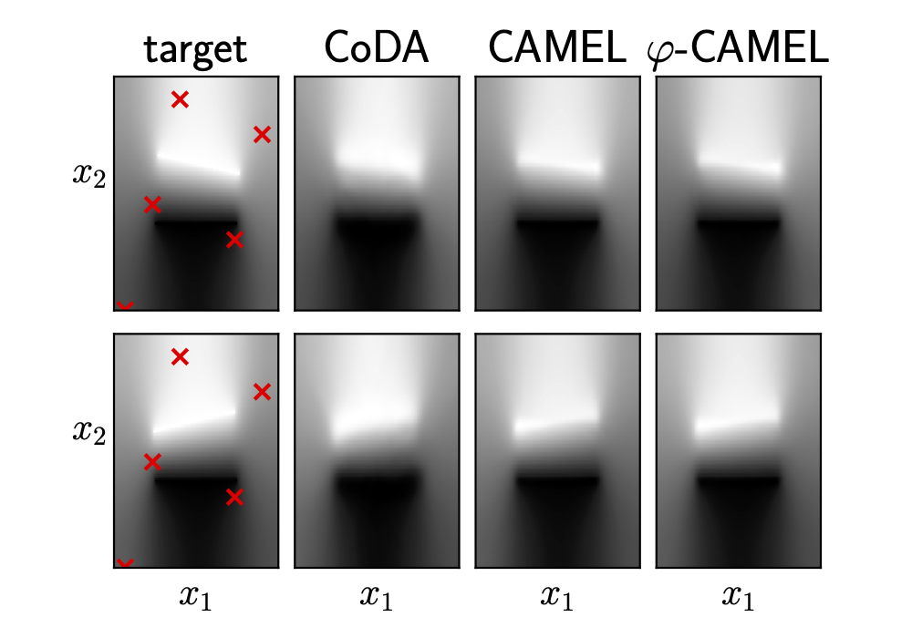
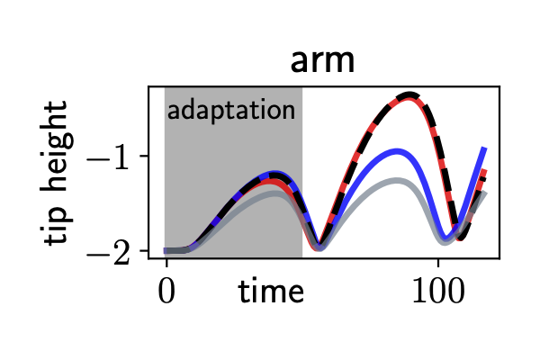
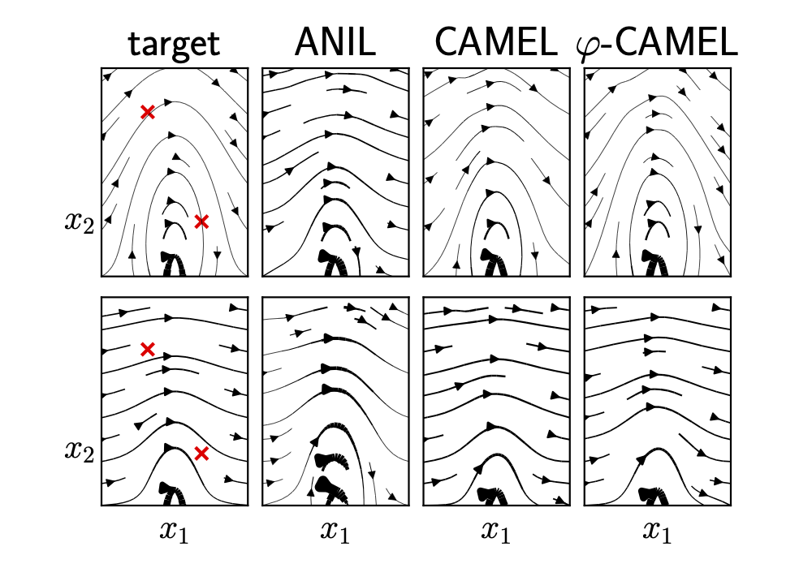

# Context-Affine Multi-Environment Learning

We introduce a meta-learning architecture that aims to learn physical systems from multi-environment data in an interpretable way.

## Demo



5-shot adaptation of a capacitor field with unknown angle and displace
ment of the upper electrode.



Trajectory tracking of a simulated robotic arm with unknown parameters using inverse dynamics. Red is CAMEL, gray is an an analytic baseline and blue is MAML.



2-shot adaptation of an electrostatic field.


## Example

```python
from models import CAMEL

V_net = torch.nn.Sequential(
    nn.Linear(2, 16),
    nn.Tanh(),
    nn.Linear(16, 16),
    nn.Tanh(),
    nn.Linear(16, r)
)
tldr = CAMEL(T_train, r, V_net, c=None)
n_gradient = 10000
optimizer = torch.optim.Adam(metamodel.parameters(), lr=0.005)
loss_function = nn.MSELoss()

for step in tqdm(range(n_gradient)):
    optimizer.zero_grad()
    loss = 0
    for task_index in range(T_train):
        task_points, task_targets = meta_dataset[task_index]
        task_model = metamodel.parametrizer(task_index, meta_dataset)
        task_predictions = task_model(task_points).squeeze()
        task_loss = loss_function(task_predictions, task_targets)
        loss += task_loss 
    loss.backward()
    optimizer.step()
```